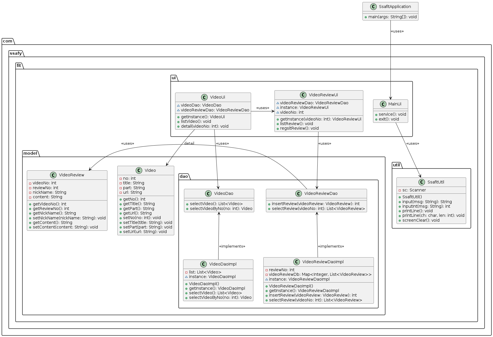

# 관통 PJT_1 회고록

### 1. "SSAFIT Project"
- Json 파일로 기록된 영상 정보 정보를 자바 언어를 통해 CRUD의 기능 구현
- 클래스 다이어그램(UML)구현
- MVC(Model - View - Controller)에 대한 이해

### 2. 회고

(1) Chat GPT를 이용하여 클래스 다이어그램 그리기
- 예시 이미지들을 캡처해서 기본적인 UML을 텍스트로 변환하는데 있어서 사용하려고 함. 이 과정에서 질문이 한번 꼬이니 계속 이상해지는 Hallucination을 경험 -> 첫 질문과 맥락에 대한 중요성을 체감했다.
- 다른 gpt 페이지를 만들어서 질문을 다시 하기 시작했을 때, 앞서 깨달은 첫 질문의 중요성에 맞게 최대한 자세히 프롬포트를 작성하고자 함. 하지만  aggregation에 대한 정보를 계속 놓치는 상황이 반복되고, 과부하의 문제인지 이미지 생성에 있어 일반적인 다이어그램이 아닌 아래 예시와 같은 텍스트 형식의 다이어그램을 만들어냄.

-----------------

+-------------------+        +-------------+
| SsafitApplication |<------>| MainUi      |
+-------------------+        +-------------+
| - main(args: String[]): void | + service(): void |
                            | + exit(): void    |
+--------------------+       +-------------+
| SsafitUtil         |
+--------------------+
| - sc: Scanner      |
| + SsafitUtil()     |
| + input(msg: String): String  |
| + inputInt(msg: String): int  |
| + inputLine(): String         |
| + printLine(ch: char): void   |
| + printLine(ch: char, len: int): void |
| + screenClear(): void         |
+--------------------+
+--------------------+        +-------------+
| VideoDao           |<------>| VideoDaoImpl|
+--------------------+        +-------------+
| + selectVideo(): List<Video>  | - list: List<Video> |
| + selectVideoByNo(no: int): Video | - instance: VideoDaoImpl |
                                | + getInstance(): VideoDaoImpl |
                                | + selectVideo(): List<Video>  |
                                | + selectVideoByNo(no: int): Video |
+---------------------+      +--------------+
| Video               |      | VideoUi      |
+---------------------+      +--------------+
| - no: int           |      | - videoDao: VideoDao |
| - title: String     |      | + service(): void    |
| - part: String      |      | + detailVideo(): void|
| - url: String       |
| + getNo(): int      |
| + setNo(no: int): void    |
| + getTitle(): String     |
| + setTitle(title: String): void  |
| + getPart(): String      |
| + setPart(part: String): void    |
| + getUrl(): String       |
| + setUrl(url: String): void      |
| + toString(): String     |
+---------------------+
+----------------------+       +-------------------+
| VideoReviewDao       |<------| VideoReviewDaoImpl|
+----------------------+       +-------------------+
| + insertReview(videoReview: VideoReview): int |
| + selectReview(videoNo: int): List<VideoReview> |
                                | - reviewNo: int         |
                                | - videoReviewDb: Map<Integer, List<VideoReview>> |
                                | - instance: VideoReviewDaoImpl |
                                | + getInstance(): VideoReviewDaoImpl |
                                | + insertReview(videoReview: VideoReview): int |
                                | + selectReview(videoNo: int): List<VideoReview> |
+----------------------+       +-------------------+
| VideoReview          |
+----------------------+
| - videoNo: int       |
| - reviewNo: int      |
| - nickName: String   |
| - content: String    |
| + getVideoNo(): int  |
| + setVideoNo(videoNo: int): void |
| + getReviewNo(): int |
| + setReviewNo(reviewNo: int): void |
| + getNickName(): String           |
| + setNickName(nickName: String): void |
| + getContent(): String            |
| + setContent(content: String): void |
+----------------------+      +------------------+
| VideoReviewUi        |      | - videoReviewDao: VideoReviewDao |
+----------------------+      | - videoNo: int                   |
| + service(): void    |      | + service(): void                |
| + listReview(): void |      | + listReview(): void             |
| + registerReview(): void  |  | + registerReview(): void        |
+----------------------+

-----------------

- 이전까지의 과정을 통해 UML의 틀이 대강 잡혀서 분업으로 보성님은 java 코드 작성을 진행했고, 다이어그램 이미지 생성이라는 분업을 진행
- ChatGPT를 이용해서 UML Script를 뽑아내고, 이를 다른 "PlantUML"이라는 사이트를 이용해서 다이어그램을 작성하는데, 여전히 gpt가 만들어준 UML 스크립트가 상속관계를 알려주지 못하거나, 화살표의 모양이 원하는대로 나오지 못하는 상황 반복

- 이때, 개념적인 것을 잘 풀어가는 장점을 가진 보성님과 역할을 바꿔 코드 작성 및 수정하는 부분으로 역할을 바꾸게 됨.
- 시간이 촉박하게 남아있는 상황에서, 코드에 대한 GPT 프롬포트는 많이 써본 경험이 있기에 부족한 부분에 있어, gpt를 통해 빠른 시간 안에 코드 전반을 완성함.
- 하지만, 출력 과정에서 이중 출력이 되거나, 메서드 이름이 충돌하는 등의 문제가 있었지만 프로젝트의 흐름을 다이어그램을 만들 때, 파악을 하고 있었기에 이전의 역할에서의 기억을 통해 디버깅을 할 수 있었다.
- 하나의 역할만을 고집하거나 소통이 부족했다면, 자신이 어떤 부분에서 더 빠른 효율이 나고, 어떤 부분을 잘하는 지 몰랐을 것이지만, 좋은 팀원을 만나 역할을 자유롭게 조정하면서 첫번째 프로젝트를 잘 마칠 수 있었다.